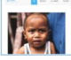
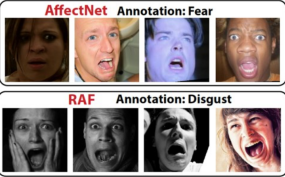

#### FER_4Classify

* 方法类型：

  * 基于深度特征提取：
    * 人脸检测、对齐
    * 提特征、分类
  * 基于AU检测方法
    * 基于FACS（面部各个部位运动），如传统的AU检测
    * 基于自监督深度学习方法，如中科院提出的TCAE方法

* 人脸识别面临的病态问题

  * 同一张人脸表情图像，不同人对其主观分类可能不同(下图有人判为fear,有人判为sad)
    * 

  * 同一个人在不同的背景下，表情的判别是不一致的（下图刨除背景可能认为是发怒，在背景中应为激动（兴奋））
    * 
  * 公开实验数据集的差异,与第一点相似（相似的表情不同数据集的标注不同）
    * 